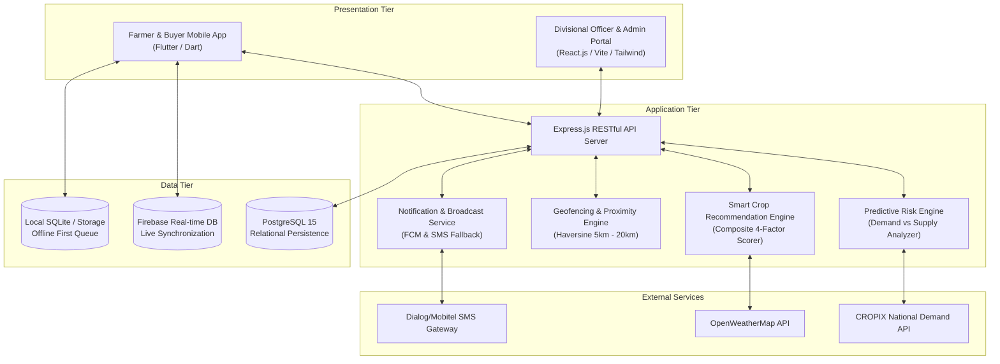

# 🏛️ ASVANNA System Architecture & Design Specification

## 1. Architectural Overview

ASVANNA is organized around a multi-tier, decoupled architecture designed for high availability, offline resilience in rural agricultural zones, and real-time synchronization.

---

## 2. Predictive Risk Engine Mathematical Model

The risk calculation algorithm monitors regional crop saturation:

$$\text{Estimated Regional Supply (kg)} = \sum (\text{Planted Acres}_i \times \text{Average Yield per Acre (kg)})$$

$$\text{Risk Ratio (\%)} = \left( \frac{\text{Estimated Regional Supply (kg)}}{\text{CROPIX Regional Demand Benchmark (kg)}} \right) \times 100$$

### Risk Tiers:
1. **Safe Level (Green)**: $\text{Risk Ratio} < 70\%$
2. **At-Risk Warning (Amber)**: $70\% \le \text{Risk Ratio} \le 85\%$
3. **Over-Planted Critical (Red)**: $\text{Risk Ratio} > 85\%$ *(Triggers emergency warning push broadcasts and crop substitution recommendation)*

---

## 3. Recommendation Composite Score Formula

$$\text{Composite Score} = (0.35 \times S_{\text{market\_gap}}) + (0.25 \times S_{\text{soil}}) + (0.20 \times S_{\text{weather}}) + (0.20 \times S_{\text{price\_trend}})$$
