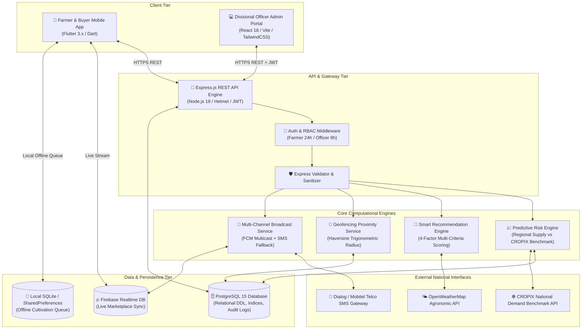
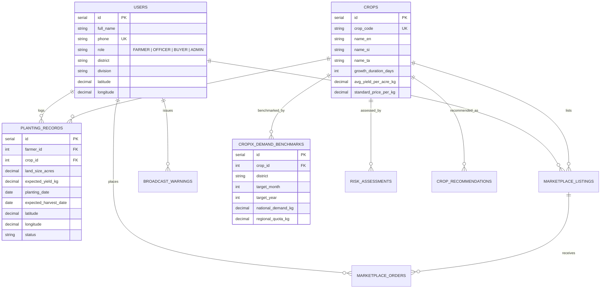

# 🌾 ASVANNA (අස්වැන්න) — Master System Documentation & Technical Architecture Manual
### *The Zero-Waste Marketplace: Guided by Real-Time Data from Seed to Harvest Distribution*

**Academic Evaluation Year:** 2025 / 2026  
**Institution:** Division of Information Technology, Institute of Technology, University of Moratuwa (ITUM)  
**Program:** National Diploma in Information Technology (NDIT) Final Year Project  
**Project Supervisor:** Mrs. Uthpala Athukorala  
**Target Geographic Pilot:** Bandarawela Agrarian Services Division, Badulla District, Sri Lanka  

---

## 📋 Table of Contents
1. [Executive Summary & Problem Statement](#1-executive-summary--problem-statement)
2. [Dual-Audience Plain-Language Guide (English, සිංහල, Singlish)](#2-dual-audience-plain-language-guide)
3. [System Architecture & Data Flow](#3-system-architecture--data-flow)
4. [Group 15 Member Allocation & Evaluation Guide](#4-group-15-member-allocation--evaluation-guide)
5. [Exhaustive File-by-File Technical Catalog](#5-exhaustive-file-by-file-technical-catalog)
   - [5.1 Root Configuration & DevOps Files](#51-root-configuration--devops-files)
   - [5.2 Backend API Core, Configuration & Database (`backend/`)](#52-backend-api-core-configuration--database)
   - [5.3 Backend Middlewares & Utilities (`backend/src/middlewares/`, `backend/src/utils/`)](#53-backend-middlewares--utilities)
   - [5.4 Backend Business Services (`backend/src/services/`)](#54-backend-business-services)
   - [5.5 Backend Controllers & Routing (`backend/src/controllers/`, `backend/src/routes/`)](#55-backend-controllers--routing)
   - [5.6 Web Admin Dashboard (`frontend/`)](#56-web-admin-dashboard)
   - [5.7 Farmer Mobile Application (`mobile/`)](#57-farmer-mobile-application)
   - [5.8 Documentation Suite (`docs/`)](#58-documentation-suite)
6. [Mathematical Models & Algorithmic Formulations](#6-mathematical-models--algorithmic-formulations)
7. [Database Schema & Data Dictionary](#7-database-schema--data-dictionary)
8. [End-to-End Testing & Verification Playbook](#8-end-to-end-testing--verification-playbook)
9. [Deployment, Environment Setup & Credentials](#9-deployment-environment-setup--credentials)

---

## 1. Executive Summary & Problem Statement

In Sri Lanka’s upcountry agricultural regions (notably Bandarawela, Welimada, Nuwara Eliya, and Badulla), smallholder farmers face severe economic vulnerability due to uncoordinated cultivation patterns. When wholesale market prices for perishable crops (such as Leeks, Cabbage, Carrots, and Beetroot) surge at economic centers (Dambulla, Manning Market, Keppetipola), farmers en masse shift cultivation to that single crop. This phenomenon is known as **"Trend Planting" (වගා රැල්ල)**.

Because perishable vegetables share similar maturity windows (60 to 90 days), thousands of metric tons reach regional markets simultaneously. This leads to:
- **Catastrophic Market Gluts:** Supply exceeds regional and national consumer demand by 150%–300%.
- **Price Crashes:** Wholesale prices plummet below harvesting and transport costs (e.g., Leeks dropping from Rs. 350/kg to Rs. 20/kg).
- **Post-Harvest Food Wastage:** Farmers discard hundreds of metric tons on roadsides or leave produce unharvested. Post-harvest vegetable losses in Sri Lanka are estimated at **30% to 40% annually (exceeding Rs. 180 Billion)**.
- **Predatory Intermediaries:** Farmers lacking real-time local demand data rely on collectors who offer exploitative farm-gate prices.

### The ASVANNA Solution
**ASVANNA (අස්වැන්න)** is a unified, real-time market intelligence and zero-waste marketplace platform designed to bridge this information gap across two synchronized operational phases:

```
                                 🌾 ASVANNA ECOSYSTEM PIPELINE
+---------------------------------------------------------------------------------------------------+
|  PHASE 1: PREDICTIVE CULTIVATION INTELLIGENCE                                                     |
|  [Farmer Mobile App / Officer Proxy] ──> [GPS Plot Log] ──> [Mathematical Risk Engine]            |
|                                                                       │                           |
|       ┌───────────────────────────────────────────────────────────────┴────────────────────┐      |
|       ▼                                                                                    ▼      |
|  [Risk < 70%: SAFE 🟢]                                             [Risk > 85%: OVER-PLANTED 🔴]   |
|  Normal Cultivation                                                1. Push Warning Broadcast      |
|                                                                    2. Smart Crop Alternatives     |
+---------------------------------------------------------------------------------------------------+
|  PHASE 2: GEO-FENCED ZERO-WASTE MARKETPLACE                                                       |
|  [Surplus Harvest Listing] ──> [Haversine 5km Radius Filter] ──> [Local Buyer Negotiation (30 min)]|
+---------------------------------------------------------------------------------------------------+
```

1. **Phase 1 (Pre-Planting Risk Mitigation):** Real-time GPS-tagged planting logging aggregated across agrarian divisions, compared continuously against national demand quotas (CROPIX API). If a crop surpasses 85% of regional saturation, the system triggers multi-channel broadcast warnings and computes a 4-factor composite suitability score to recommend profitable alternative crops.
2. **Phase 2 (Post-Harvest Zero-Waste Marketplace):** A localized 5 km geo-fenced marketplace allowing farmers with unharvested or surplus batches to negotiate directly with nearby buyers (commercial hoteliers, restaurants, food processors, bulk consumers) within a 30-minute bidding window.
3. **Digital Inclusivity (Proxy Entry):** Offline farmers without smartphones can register cultivation data via Divisional Agrarian Officers (DOs), guaranteeing 100% data fidelity on regional saturation maps.

---

## 2. Dual-Audience Plain-Language Guide

To ensure ASVANNA serves both technical examiners and rural agricultural stakeholders, the system concepts are translated below into simple English, Sinhala (සිංහල), and Singlish:

### 2.1 For Agricultural Officers & Farmers (ගොවි මහතුන් සහ කෘෂිකර්ම නිලධාරීන් සඳහා)

| Technical Concept | Simple English Explanation | සිංහල පැහැදිලි කිරීම | Singlish Guide (Easy Read) |
|---|---|---|---|
| **Trend Planting (වගා රැල්ල)** | Farmers planting the same crop at once because current market prices are high, causing a future price crash. | වෙළඳපලේ අද පවතින ඉහළ මිල දැක සියලු ගොවීන් එකවර එකම බෝගය වගා කිරීම නිසා මාස කිහිපයකින් මිල කඩා වැටීම. | Govi mahathwaru ada market eke ganan balala ekama boga wargaya ekawara wawanawa. Ethakota mas 3kin okkoma ekawara aswanna gaththama market eka pirila mila bahinawa. |
| **Predictive Risk Engine** | A system formula comparing total planted acres in Bandarawela against national monthly consumption targets. | බණ්ඩාරවෙල වගා කර ඇති මුළු බිම් ප්‍රමාණය සහ රටේ මාසික පරිභෝජන අවශ්‍යතාවය සැසඳීමේ ගණිතමය ක්‍රමවේදය. | Bandarawela wawa thiyena mulu bima pramanaya lankawe masika illuma (CROPIX) ekka bedala, thawa wawanna puluwanda kiyala 85% threshold eken balanawa. |
| **Smart Crop Alternatives** | Recommending high-income crops (e.g., Beetroot, Knol Khol) when Leeks or Cabbage are over-planted. | ප්‍රධාන බෝගය අධික ලෙස වගා කර ඇත්නම්, වැඩි ලාභයක් ලබාගත හැකි වෙනත් විකල්ප බෝග නිර්දේශ කිරීම. | Wena labadayaka boga (Beetroot, Knol Khol) 4-factor scoring eken rank karala farmer ta pennanawa. |
| **Geo-Fenced Surplus Marketplace** | Selling excess vegetable harvest directly to local hotels within a 5 km radius to avoid transport loss. | ඉතිරි වන අස්වැන්න කිලෝමීටර් 5ක් ඇතුළත හෝටල් සහ ගැනුම්කරුවන්ට අතරමැදියන් රහිතව විකිණීම. | Ithuru wena aswanna 5km athule thiyena hotel/buyerslata direct wikunala transport cost eka ithuru karaganna puluwan. |
| **Proxy Data Entry** | Agrarian officers entering data on behalf of farmers who do not own a smartphone. | ස්මාර්ට් ජංගම දුරකථන නොමැති ගොවීන් වෙනුවෙන් ගොවිජන සේවා නිලධාරියා විසින් දත්ත පද්ධතියට ඇතුළත් කිරීම. | Smart phone nathi govinta Divisional Officer portal eken data enter karanna puluwan. |

---

## 3. System Architecture & Data Flow

ASVANNA adopts a modular, multi-tier enterprise architecture built for resilient offline operation, low-latency mobile updates, and strict role-based access control.



---

## 4. Group 15 Member Allocation & Evaluation Guide

The ASVANNA platform is engineered by a 5-member team from the Division of Information Technology, Institute of Technology, University of Moratuwa. Each student owns a dedicated technical subsystem:

```
+──────────────────────────────────────────────────────────────────────────────────────────────────+
|                                    GROUP 15 TEAM CONTRIBUTIONS                                   |
+---+----------------------------+----------+------------------------------------------------------+
| # | Student Full Name          | Reg. No  | Assigned Core Engineering Module                     |
+---+----------------------------+----------+------------------------------------------------------+
| 1 | W. N. A. Wedikkara         | 23IT0544 | Architecture, Auth/RBAC, DB & Predictive Risk Engine |
| 2 | R. R. L. Geeganage (Ravindi)| 23IT0476 | Smart Crop Recommendation & Agro-Suitability Engine  |
| 3 | G. W. T. Jayampathi        | 23IT0487 | Divisional Officer Web Portal, Proxy Entry & Alerts  |
| 4 | K. A. H. I. Lakshitha (Imal)| 23IT0503 | Farmer Flutter Mobile App, GPS Plots & Offline Queue |
| 5 | K. H. M. Dewanga           | 23IT0467 | 5 km Geo-Fenced Zero-Waste Surplus Marketplace       |
+---+----------------------------+----------+------------------------------------------------------+
```

### 👤 Member 1: W. N. A. Wedikkara (23IT0544)
- **Role:** Lead Architect, Database Engineer & Risk Algorithm Designer
- **Assigned Module:** System Architecture, PostgreSQL Relational Schema, JWT Role-Based Access Control (RBAC), and Mathematical Predictive Risk Engine.
- **Key Files Authored:**
  - `backend/src/services/riskEngineService.js`
  - `backend/src/controllers/riskEngineController.js`
  - `backend/src/routes/riskRoutes.js`
  - `backend/src/database/schema.sql`
  - `backend/src/database/migrate.js`
  - `backend/src/database/seed.js`
  - `backend/src/middlewares/authMiddleware.js`
  - `backend/src/config/database.js`
  - `backend/src/controllers/authController.js`
- **Evaluation & Testing Instructions for Examiners:**
  1. Verify the PostgreSQL schema with foreign keys and indices by running `npm run migrate` in `backend/`.
  2. Verify the 3-tier risk logic (`SAFE` <70%, `WARNING` 70-85%, `OVER_PLANTED` >85%) by running:
     ```bash
     node backend/test/test_all_endpoints.js
     ```
  3. Query the crop saturation endpoint for Leeks:
     ```bash
     curl -H "Authorization: Bearer <TOKEN>" http://localhost:5000/api/v1/risk/crop/1
     ```

---

### 👤 Member 2: R. R. L. Geeganage (Ravindi - 23IT0476)
- **Role:** AI & Agronomic Recommendation Engineer
- **Assigned Module:** Smart Crop Recommendation Engine, 4-Factor Weighted Multi-Criteria Composite Scoring, Agro-climatic and Soil Suitability Modeling.
- **Key Files Authored:**
  - `backend/src/services/recommendationService.js`
  - `backend/src/controllers/recommendationController.js`
  - `backend/src/routes/recommendationRoutes.js`
  - `frontend/src/pages/RiskAnalytics.jsx`
  - `mobile/lib/features/recommendations/smart_crop_recommendation_screen.dart`
- **Evaluation & Testing Instructions for Examiners:**
  1. Inspect the composite weighting formula:
     $$\text{Composite} = 0.35 \times S_{\text{market\_gap}} + 0.25 \times S_{\text{soil}} + 0.20 \times S_{\text{weather}} + 0.20 \times S_{\text{price\_trend}}$$
  2. Verify that over-planted crops (e.g. Leeks) are filtered out from recommendation outputs:
     ```bash
     curl -H "Authorization: Bearer <TOKEN>" "http://localhost:5000/api/v1/recommendations?district=Badulla&cropId=1"
     ```
  3. Verify that candidate crops (Beetroot 92%, Knol Khol 88%) are sorted descending by score with Sinhala/Tamil/English rationales.

---

### 👤 Member 3: G. W. T. Jayampathi (23IT0487)
- **Role:** Frontend Lead & Digital Inclusivity Engineer
- **Assigned Module:** Divisional Agrarian Officer (DO) React Web Portal, Digital Inclusivity Proxy Data Entry for offline farmers, Multilingual Engine (EN/SI/TA), and Regional Broadcast Warning Dispatcher with FCM and SMS Fallback.
- **Key Files Authored:**
  - `frontend/src/pages/Dashboard.jsx`
  - `frontend/src/pages/RegionalMonitoring.jsx`
  - `frontend/src/pages/FarmerDirectory.jsx`
  - `frontend/src/pages/Broadcasts.jsx`
  - `frontend/src/components/ProxyDataModal.jsx`
  - `frontend/src/components/BroadcastModal.jsx`
  - `frontend/src/context/LanguageContext.jsx`
  - `frontend/src/locales/en.json`, `si.json`, `ta.json`
  - `backend/src/controllers/officerController.js`
  - `backend/src/controllers/broadcastController.js`
  - `backend/src/services/notificationService.js`
- **Evaluation & Testing Instructions for Examiners:**
  1. Access the web dashboard at `http://localhost:3000` and sign in with Officer credentials (`0771234567` / `asvanna123`).
  2. Click the language toggle buttons in the top navbar (`EN`, `සිං`, `தமி`) to verify dynamic translation across the UI.
  3. Click **"+ Proxy Data Entry"**, submit a cultivation plot on behalf of an offline farmer, and verify immediate chart update.
  4. Click **"Broadcast Warnings"** and issue an alert to test multi-channel dispatch.

---

### 👤 Member 4: K. A. H. I. Lakshitha (Imal - 23IT0503)
- **Role:** Mobile Application Lead & Offline-First Engineer
- **Assigned Module:** Flutter Cross-Platform Mobile Application for Farmers, GPS-Tagged Cultivation Logging, Offline Storage Queue (SharedPreferences/SQLite), and Auto-Sync Engine.
- **Key Files Authored:**
  - `mobile/lib/main.dart`
  - `mobile/lib/core/services/location_service.dart`
  - `mobile/lib/core/services/offline_storage_service.dart`
  - `mobile/lib/core/network/api_client.dart`
  - `mobile/lib/core/theme/app_theme.dart`
  - `mobile/lib/features/auth/login_screen.dart`
  - `mobile/lib/features/home/farmer_home_screen.dart`
  - `mobile/lib/features/planting/log_planting_screen.dart`
  - `mobile/lib/l10n/app_en.arb`, `app_si.arb`, `app_ta.arb`
- **Evaluation & Testing Instructions for Examiners:**
  1. Run the Flutter mobile app on an Android emulator or device (`cd mobile && flutter run`).
  2. Open **"Log Planting"**, confirm automatic GPS coordinate retrieval with Bandarawela fallback (`6.8258, 80.9982`).
  3. Enable Airplane Mode on the mobile device, submit a planting record, and inspect local storage queue retention. Reconnect network to verify automated synchronization.

---

### 👤 Member 5: K. H. M. Dewanga (23IT0467)
- **Role:** Geospatial & Marketplace Negotiation Engineer
- **Assigned Module:** Phase 2 Geo-Fenced Zero-Waste Surplus Marketplace, Haversine 5 km Proximity Radius Matching Algorithm, Direct Buyer-Farmer Negotiation Engine, and 30-Minute Counter-Offer State Machine.
- **Key Files Authored:**
  - `backend/src/services/geofencingService.js`
  - `backend/src/services/marketplaceService.js`
  - `backend/src/controllers/marketplaceController.js`
  - `backend/src/routes/marketplaceRoutes.js`
  - `backend/src/utils/haversine.js`
  - `frontend/src/pages/MarketplaceSurplus.jsx`
  - `mobile/lib/features/marketplace/marketplace_feed_screen.dart`
  - `mobile/lib/features/marketplace/list_surplus_screen.dart`
- **Evaluation & Testing Instructions for Examiners:**
  1. Run the unit test for the Haversine trigonometric distance calculation:
     ```bash
     node backend/test/test_all_endpoints.js
     ```
  2. Publish a surplus produce batch:
     ```bash
     curl -X POST http://localhost:5000/api/v1/marketplace/list \
       -H "Authorization: Bearer <FARMER_TOKEN>" \
       -H "Content-Type: application/json" \
       -d '{"crop_id":1, "quantity_kg":450, "price_per_kg":240, "available_from":"2026-08-25", "available_to":"2026-08-30", "latitude":6.8258, "longitude":80.9982, "pickup_address":"Bandarawela Main Market Road"}'
     ```
  3. Search nearby listings within 5 km:
     ```bash
     curl -H "Authorization: Bearer <BUYER_TOKEN>" "http://localhost:5000/api/v1/marketplace/search-nearby?lat=6.8265&lng=80.9970&radius_km=5"
     ```
  4. Place an order to test the 30-minute response deadline counter.

---

## 5. Exhaustive File-by-File Technical Catalog

Every single source code and configuration file across the entire repository is cataloged and explained below.

---

### 5.1 Root Configuration & DevOps Files

#### 📄 `docker-compose.yml`
- **Exact Purpose:** Multi-container Docker orchestration configuration defining PostgreSQL 15, Node.js Backend API, and React Web Admin dashboard services.
- **Why Needed in ASVANNA:** Allows university evaluators, agronomic teams, or cloud engineers to deploy the entire ecosystem in one command without manual dependency installations.
- **Connected Files & Dependencies:** `backend/Dockerfile`, `frontend/Dockerfile`, `backend/src/database/schema.sql`.
- **Required Configurations:** Exposes ports `5432` (PostgreSQL), `5000` (API), and `3000` (Web Admin). Uses named volume `postgres_data`.
- **Code & Logic Breakdown:** Defines three interconnected service blocks (`postgres`, `backend`, `web-admin`) with health-check dependencies (`depends_on: postgres condition: service_healthy`).
- **Singlish / Sinhala Explanation:** *Meka Docker compose file eka. Postgres database eka, backend API eka saha React web admin portal eka ekama command eken (`docker-compose up`) start karanna meka use karanawa.*
- **How to Test:** Run `docker-compose up --build -d` and inspect container status via `docker-compose ps`.

#### 📄 `.github/workflows/ci.yml`
- **Exact Purpose:** Continuous Integration (CI) automation script for GitHub Actions.
- **Why Needed in ASVANNA:** Enforces code quality, builds dependencies, and runs automated tests on every `git push` or `pull_request` to `main` and `develop` branches.
- **Connected Files & Dependencies:** `backend/package.json`, `frontend/package.json`, `backend/test/test_all_endpoints.js`.
- **Required Configurations:** Ubuntu-latest runner, Node.js 18.x.
- **Code & Logic Breakdown:** Contains two jobs: `backend-checks` (`npm ci`, `npm test`) and `frontend-checks` (`npm ci`, `npm run build`).
- **Singlish / Sinhala Explanation:** *GitHub ekata code push karaddi automatically test run wela build eka pass da kiyala check karana automated pipeline script eka.*
- **How to Test:** Push any commit to GitHub or run `act` locally to simulate the workflow.

#### 📄 `setup-individual-repos.sh`
- **Exact Purpose:** Bash utility to split the monorepo into 3 isolated Git repositories (`backend`, `frontend`, `mobile`).
- **Why Needed in ASVANNA:** Enables modular development for teams who prefer separate GitHub repositories per sub-project.
- **Connected Files & Dependencies:** Root folders `backend/`, `frontend/`, `mobile/`.
- **Required Configurations:** Bash shell with `git` CLI installed.
- **Code & Logic Breakdown:** Loops through directories, initializes `git init -b main`, stages all files, and creates initial feature commits.
- **Singlish / Sinhala Explanation:** *Monorepo eka wen wenma backend, frontend, mobile kiyala git repo 3kata kadala setup karana bash script eka.*
- **How to Test:** Execute `chmod +x setup-individual-repos.sh && ./setup-individual-repos.sh`.

#### 📄 `.gitignore`
- **Exact Purpose:** Specifies intentionally untracked files to ignore when committing to Git.
- **Why Needed in ASVANNA:** Prevents committing sensitive credentials (`.env`), heavy dependencies (`node_modules/`, `.dart_tool/`), and build artifacts (`dist/`, `build/`).
- **Singlish / Sinhala Explanation:** *Git ekata upload no-viya yuthu temporary files (node_modules, passwords thiyena .env) ignore karanna hadapu file eka.*

#### 📄 `README.md`
- **Exact Purpose:** Top-level project documentation and quick-start repository manual.
- **Why Needed in ASVANNA:** Provides initial project context, academic team details, architectural diagram, and setup instructions.
- **Singlish / Sinhala Explanation:** *Project eke main overview eka, memberslage wisthara, saha run karana widiha thiyena main README file eka.*

---

### 5.2 Backend API Core, Configuration & Database

#### 📄 `backend/src/server.js`
- **Exact Purpose:** Application bootstrapper and HTTP server listener.
- **Why Needed in ASVANNA:** Starts Express on the configured port and manages graceful shutdown on POSIX signals.
- **Connected Files & Dependencies:** Imports `backend/src/app.js` and `backend/src/config/config.js`.
- **Required Configurations:** `PORT` (default: 5000), `NODE_ENV`.
- **Code & Logic Breakdown:** Calls `app.listen(config.port)` and logs startup URLs. Listens for `SIGTERM` to close socket connections cleanly.
- **Singlish / Sinhala Explanation:** *Backend eka run karana main entry point eka. Server eka port 5000 eke listen karanna patan ganne meken.*
- **How to Test:** Run `npm start` inside `backend/`. Expected output: `🌾 ASVANNA Backend API Server Started`.

#### 📄 `backend/src/app.js`
- **Exact Purpose:** Express application configuration and middleware pipeline assembler.
- **Why Needed in ASVANNA:** Configures HTTP security headers (Helmet), Cross-Origin Resource Sharing (CORS), JSON body parsing, route mounting, 404 handlers, and global error middleware.
- **Connected Files & Dependencies:** Mounts 7 route modules (`authRoutes`, `plantingRoutes`, `riskRoutes`, `recommendationRoutes`, `marketplaceRoutes`, `officerRoutes`, `broadcastRoutes`).
- **Required Configurations:** None directly (inherits from config).
- **Code & Logic Breakdown:** Configures middleware pipeline in order: security -> logging -> parsing -> route controllers -> 404 handler -> global error catcher.
- **Singlish / Sinhala Explanation:** *Express app eke router okkoma ekathu karala security middlewares (Helmet, CORS) set karana central app setup file eka.*
- **How to Test:** Send a GET request to `http://localhost:5000/health`.

#### 📄 `backend/src/config/config.js`
- **Exact Purpose:** Centralized environment configuration and defaults provider.
- **Why Needed in ASVANNA:** Prevents hardcoding of database passwords, JWT secrets, and API keys across the codebase.
- **Connected Files & Dependencies:** Loads `.env` using `dotenv`. Imported by all services, database modules, and controllers.
- **Required Configurations:** `DB_HOST`, `DB_PORT`, `DB_USER`, `DB_PASSWORD`, `DB_NAME`, `JWT_SECRET`, `RISK_SAFE_THRESHOLD`, `RISK_WARNING_THRESHOLD`.
- **Code & Logic Breakdown:** Exports a structured JavaScript object with parsed numbers and fallback constants.
- **Singlish / Sinhala Explanation:** *.env file eke thiyena settings (database password, JWT keys, risk percentages) read karala structured object ekak widihata code ekata dena file eka.*
- **How to Test:** Execute `node -e 'console.log(require("./src/config/config"))'`.

#### 📄 `backend/src/config/database.js`
- **Exact Purpose:** PostgreSQL connection pool manager.
- **Why Needed in ASVANNA:** Provides connection pooling to handle concurrent database queries efficiently with automatic client reuse.
- **Connected Files & Dependencies:** Uses `pg` Pool class. Used by all services and controllers executing SQL queries.
- **Required Configurations:** Database connection parameters in `config.db`.
- **Code & Logic Breakdown:** Initializes `new Pool(config.db)`, attaches error listeners on idle clients, and exports a reusable `query(text, params)` helper.
- **Singlish / Sinhala Explanation:** *PostgreSQL database ekata connection pool ekak hadala queries run karanna help wena database connector file eka.*
- **How to Test:** Run `node -e 'require("./src/config/database").query("SELECT NOW()").then(r => console.log(r.rows))'`.

#### 📄 `backend/src/config/firebase.js`
- **Exact Purpose:** Firebase Admin SDK initializer for Push Notifications (FCM) and Realtime Database.
- **Why Needed in ASVANNA:** Powers real-time marketplace syncing and emergency officer broadcasts to farmers' mobile phones.
- **Connected Files & Dependencies:** `firebase-admin`. Imported by `notificationService.js` and `marketplaceService.js`.
- **Required Configurations:** `FIREBASE_PROJECT_ID`, `FIREBASE_CLIENT_EMAIL`, `FIREBASE_PRIVATE_KEY`, `FIREBASE_DATABASE_URL`.
- **Code & Logic Breakdown:** Initializes Firebase Admin with service account credentials if present; gracefully falls back to mock mode if absent to prevent server crashes.
- **Singlish / Sinhala Explanation:** *Firebase push notifications (FCM) saha live marketplace sync wada karanna Firebase Admin SDK initialize karana file eka.*

#### 📄 `backend/src/database/schema.sql`
- **Exact Purpose:** Complete PostgreSQL Data Definition Language (DDL) defining the 10 core tables, relations, constraints, and indexes.
- **Why Needed in ASVANNA:** Enforces relational integrity across users, crops, GPS planting records, CROPIX demand benchmarks, risk snapshots, and marketplace transactions.
- **Connected Files & Dependencies:** Executed by `migrate.js` or `docker-compose.yml`.
- **Tables Defined:** `users`, `crops`, `planting_records`, `cropix_demand_benchmarks`, `risk_assessments`, `crop_recommendations`, `marketplace_listings`, `marketplace_orders`, `broadcast_warnings`, `audit_logs`.
- **Singlish / Sinhala Explanation:** *ASVANNA system eke tables 10 ma (users, crops, planting, risk, marketplace, etc.) create karana main SQL schema file eka.*
- **How to Test:** Run `psql -d asvanna_db -f backend/src/database/schema.sql`.

#### 📄 `backend/src/database/migrate.js`
- **Exact Purpose:** Automated SQL migration runner.
- **Why Needed in ASVANNA:** Executes `schema.sql` against the active database without needing external database GUI clients.
- **Connected Files & Dependencies:** `fs`, `path`, `database.js`, `schema.sql`.
- **Code & Logic Breakdown:** Reads `schema.sql` as a UTF-8 string and executes it via `db.query(sql)`.
- **Singlish / Sinhala Explanation:** *Database schema eka database ekata automatically apply karana migration script eka.*
- **How to Test:** Run `npm run migrate` in `backend/`.

#### 📄 `backend/src/database/seed.js`
- **Exact Purpose:** Master data and demo account seeder for the Bandarawela pilot region.
- **Why Needed in ASVANNA:** Populates the system with 8 upcountry crops (Leeks, Cabbage, Carrot, Beetroot, Potato, Knol Khol, Bell Pepper, Tomato), demo users with hashed passwords, and monthly CROPIX demand quotas.
- **Connected Files & Dependencies:** `bcryptjs`, `database.js`.
- **Code & Logic Breakdown:** Uses parameterized SQL `INSERT ... ON CONFLICT DO NOTHING` to guarantee idempotency. Hashes passwords using bcrypt with 10 salt rounds.
- **Singlish / Sinhala Explanation:** *Bandarawela pilot ekata adala boga 8ka data, demo accounts (Officer, Farmer, Buyer), saha CROPIX demand quota database ekata load karana seed script eka.*
- **How to Test:** Run `npm run seed` in `backend/`.

---

### 5.3 Backend Middlewares & Utilities

#### 📄 `backend/src/middlewares/authMiddleware.js`
- **Exact Purpose:** JWT Token Verification and Role-Based Access Control (RBAC).
- **Why Needed in ASVANNA:** Secures protected endpoints and restricts sensitive operations (such as Proxy Data Entry and Broadcast Warnings) exclusively to verified Divisional Officers and Admins.
- **Connected Files & Dependencies:** `jsonwebtoken`, `config.js`, `apiResponse.js`.
- **Code & Logic Breakdown:**
  - `authenticate()`: Extracts `Bearer <token>` from Authorization header, validates signature and expiration, and attaches `req.user`.
  - `authorizeRoles(...roles)`: Verifies if `req.user.role` matches the required permission set; returns `403 Forbidden` if unauthorized.
- **Singlish / Sinhala Explanation:** *User ge login token eka (JWT) check karala, user ge role eka (FARMER / OFFICER / ADMIN) anuwa actions allow ho block karana security middleware eka.*
- **How to Test:** Request any protected endpoint without token -> Expect `401 Unauthorized`. Request with invalid role -> Expect `403 Forbidden`.

#### 📄 `backend/src/middlewares/errorHandler.js`
- **Exact Purpose:** Global Express error-handling middleware.
- **Why Needed in ASVANNA:** Prevents server crashes on unhandled exceptions and formats error responses into consistent JSON objects.
- **Connected Files & Dependencies:** `apiResponse.js`.
- **Code & Logic Breakdown:** Catches errors passed via `next(err)`, logs stack traces to console, and sends formatted response hiding internal stacks in production.
- **Singlish / Sinhala Explanation:** *Code eke kohe hari error ekak unoth server eka crash wenne nathuwa neat JSON message ekak yawana global error handler eka.*

#### 📄 `backend/src/middlewares/validationMiddleware.js`
- **Exact Purpose:** Request body validation schema evaluator.
- **Why Needed in ASVANNA:** Sanitizes and validates user input (e.g., GPS coordinates, positive acreage, valid ISO dates) before reaching controllers.
- **Connected Files & Dependencies:** `express-validator`, `apiResponse.js`.
- **Code & Logic Breakdown:** Calls `validationResult(req)`. If errors exist, intercepts execution and returns `400 Bad Request` with array of validation issues.
- **Singlish / Sinhala Explanation:** *User submit karana data (coordinates, acres) hari format ekenda thiyenne kiyala check karana validation validator eka.*

#### 📄 `backend/src/utils/apiResponse.js`
- **Exact Purpose:** Standardized JSON response wrapper.
- **Why Needed in ASVANNA:** Guarantees uniform API response structures across web and mobile clients: `{ success, message, data, timestamp }`.
- **Code & Logic Breakdown:** Exposes static methods `ApiResponse.success()` and `ApiResponse.error()`.
- **Singlish / Sinhala Explanation:** *API response okkoma ekama format ekata (success, message, data, timestamp) hadala yawana helper class eka.*

#### 📄 `backend/src/utils/haversine.js`
- **Exact Purpose:** Haversine great-circle distance calculator.
- **Why Needed in ASVANNA:** Calculates exact physical distances between farmer plots and local buyers across spherical Earth coordinates for the 5 km geo-fenced marketplace.
- **Mathematical Formula:**
  $$d = 2R \arcsin \left( \sqrt{\sin^2\left(\frac{\Delta \phi}{2}\right) + \cos(\phi_1)\cos(\phi_2)\sin^2\left(\frac{\Delta \lambda}{2}\right)} \right)$$
- **Singlish / Sinhala Explanation:** *GPS coordinates deka athara dura (km walin) ganan balana Haversine trigonometric formula eka implement karala thiyena file eka.*
- **How to Test:** Run `node backend/test/test_all_endpoints.js`.

---

### 5.4 Backend Business Services

#### 📄 `backend/src/services/riskEngineService.js`
- **Exact Purpose:** Core mathematical engine for calculating regional crop supply density and 3-tier saturation risk.
- **Why Needed in ASVANNA:** Solves the root cause of "Trend Planting" by detecting over-planting before harvest.
- **Connected Files & Dependencies:** `database.js`, `config.js`.
- **Code & Logic Breakdown:**
  1. Aggregates active planted acres for given crop and district: $\sum \text{land\_size\_acres} \times \text{avg\_yield}$.
  2. Fetches monthly demand quota from `cropix_demand_benchmarks`.
  3. Computes $\text{Risk Ratio} = (\text{Supply} / \text{Demand}) \times 100$.
  4. Classifies risk into `SAFE` (<70%), `WARNING` (70–85%), or `OVER_PLANTED` (>85%).
  5. Persists evaluation snapshot in `risk_assessments` table.
- **Singlish / Sinhala Explanation:** *Wawa thiyena total acres ganan balala, CROPIX demand eka ekka compare karala risk eka 70% adunam SAFE, 70-85% nam WARNING, 85% wadinam OVER_PLANTED kiyala calculate karana service eka.*
- **How to Test:** Call `RiskEngineService.evaluateCropRisk(1, 'Badulla')`.

#### 📄 `backend/src/services/recommendationService.js`
- **Exact Purpose:** Multi-criteria alternative crop recommendation algorithm.
- **Why Needed in ASVANNA:** Provides scientifically sound crop alternatives when a farmer's primary crop is saturated.
- **Connected Files & Dependencies:** `database.js`, `riskEngineService.js`.
- **Code & Logic Breakdown:**
  - Evaluates candidate crops in the district and filters out over-planted crops.
  - Computes 4 individual criteria scores (0–100):
    1. Market Gap Score ($S_{\text{gap}} = 100 - \text{Risk}\%$) [35% Weight]
    2. Soil Suitability Score ($S_{\text{soil}}$) [25% Weight]
    3. Weather/Temperature Suitability ($S_{\text{weather}}$) [20% Weight]
    4. Price Trend Score ($S_{\text{price}}$) [20% Weight]
  - Calculates composite weighted score:
    $$\text{Composite} = \text{round}(0.35 S_{\text{gap}} + 0.25 S_{\text{soil}} + 0.20 S_{\text{weather}} + 0.20 S_{\text{price}})$$
  - Ranks candidates descending and generates multi-lingual agronomic rationales.
- **Singlish / Sinhala Explanation:** *Boga wargayak over-plant wela thiyeddi, wena wawanna puluwan boga 4-factor formula ekakin score karala top 5 recommend karana engine eka.*

#### 📄 `backend/src/services/geofencingService.js`
- **Exact Purpose:** Spatial filtering and ranking of surplus produce listings.
- **Why Needed in ASVANNA:** Matches local commercial buyers with nearby farmers within 5 km to eliminate transport costs and prevent post-harvest spoilage.
- **Connected Files & Dependencies:** `haversine.js`, `config.js`.
- **Code & Logic Breakdown:** Iterates over active marketplace items, calculates distance to buyer GPS coordinates, filters items where `distanceKm <= maxRadiusKm` (default 5 km), and sorts ascending by distance.
- **Singlish / Sinhala Explanation:** *Buyer ge location eke idan 5km athule thiyena surplus produce listings filter karala langama ewa mulata daala sort karana service eka.*

#### 📄 `backend/src/services/notificationService.js`
- **Exact Purpose:** Multi-channel alert dispatcher (Push Notifications via FCM + SMS Fallback).
- **Why Needed in ASVANNA:** Ensures emergency saturation warnings reach all farmers—both smartphone users and basic feature phone users.
- **Connected Files & Dependencies:** `firebase.js`, `database.js`.
- **Code & Logic Breakdown:** Retrieves FCM device tokens and phone numbers for targeted farmers. Dispatches multicast push notifications via Firebase; if FCM fails or recipient is offline, dispatches SMS payload via telco gateway.
- **Singlish / Sinhala Explanation:** *DO Officer warning ekak dapu gaman smartphone thiyena ayata Firebase Push notification yawala, anith ayata SMS yawana service eka.*

#### 📄 `backend/src/services/marketplaceService.js`
- **Exact Purpose:** Real-time synchronization service for marketplace listings.
- **Why Needed in ASVANNA:** Provides sub-second updates to mobile and web clients when surplus produce is listed or reserved.
- **Connected Files & Dependencies:** `firebase.js` (Realtime Database).
- **Code & Logic Breakdown:** Updates `/marketplace_listings/{id}` in Firebase Realtime Database upon creation or status alteration.
- **Singlish / Sinhala Explanation:** *Marketplace eke aluth boga dapu gaman Firebase Realtime DB eka update karala mobile app walata live pennana service eka.*

---

### 5.5 Backend Controllers & Routing

#### 📄 `backend/src/controllers/authController.js` & `backend/src/routes/authRoutes.js`
- **Exact Purpose:** User registration, credential authentication, profile management, and FCM token registration.
- **Why Needed in ASVANNA:** Manages access across all four user personas (`FARMER`, `OFFICER`, `BUYER`, `ADMIN`).
- **Endpoints:**
  - `POST /api/v1/auth/register`: Creates new user with bcrypt password hash.
  - `POST /api/v1/auth/login`: Verifies phone/password and returns signed JWT (24h for Farmers, 8h for Officers).
  - `GET /api/v1/auth/me`: Returns profile of authenticated user.
  - `POST /api/v1/auth/fcm-token`: Updates device push notification token.
- **How to Test:**
  ```bash
  curl -X POST http://localhost:5000/api/v1/auth/login \
    -H "Content-Type: application/json" \
    -d '{"phone":"0771234567","password":"asvanna123"}'
  ```

#### 📄 `backend/src/controllers/plantingController.js` & `backend/src/routes/plantingRoutes.js`
- **Exact Purpose:** Handles GPS cultivation plot logging, farmer planting histories, and regional map plot queries.
- **Why Needed in ASVANNA:** Captures ground-truth cultivation data to feed the Predictive Risk Engine.
- **Endpoints:**
  - `POST /api/v1/planting/log`: Inserts planting record (calculates expected harvest date based on crop growth duration) and triggers immediate risk recalculation.
  - `GET /api/v1/planting/farmer/:farmerId?`: Retrieves cultivation history for specific farmer.
  - `GET /api/v1/planting/regional-map`: Retrieves all active plots in a district/division for GIS mapping.
- **How to Test:**
  ```bash
  curl -X POST http://localhost:5000/api/v1/planting/log \
    -H "Authorization: Bearer <TOKEN>" \
    -H "Content-Type: application/json" \
    -d '{"crop_id":1,"land_size_acres":1.2,"planting_date":"2026-08-23","latitude":6.8258,"longitude":80.9982}'
  ```

#### 📄 `backend/src/controllers/riskEngineController.js` & `backend/src/routes/riskRoutes.js`
- **Exact Purpose:** Exposes REST endpoints for individual crop risk evaluations and regional saturation summaries.
- **Why Needed in ASVANNA:** Powers dashboard saturation progress bars and mobile over-planting alerts.
- **Endpoints:**
  - `GET /api/v1/risk/crop/:cropId`: Computes live risk for specific crop in district.
  - `GET /api/v1/risk/regional-summary`: Returns saturation metrics across all 8 master crops.
- **How to Test:**
  ```bash
  curl -H "Authorization: Bearer <TOKEN>" http://localhost:5000/api/v1/risk/regional-summary?district=Badulla
  ```

#### 📄 `backend/src/controllers/recommendationController.js` & `backend/src/routes/recommendationRoutes.js`
- **Exact Purpose:** Exposes smart crop recommendation API.
- **Why Needed in ASVANNA:** Delivers ranked alternative crops to farmers when current crops are at risk.
- **Endpoints:**
  - `GET /api/v1/recommendations`: Returns top 5 ranked crop alternatives with composite scores and multi-lingual rationales.
- **How to Test:**
  ```bash
  curl -H "Authorization: Bearer <TOKEN>" "http://localhost:5000/api/v1/recommendations?district=Badulla&cropId=1"
  ```

#### 📄 `backend/src/controllers/marketplaceController.js` & `backend/src/routes/marketplaceRoutes.js`
- **Exact Purpose:** Manages surplus produce listings, 5 km proximity queries, and buyer purchase negotiation offers.
- **Why Needed in ASVANNA:** Powers the Phase 2 Zero-Waste direct marketplace.
- **Endpoints:**
  - `POST /api/v1/marketplace/list`: Publishes surplus batch.
  - `GET /api/v1/marketplace/search-nearby`: Returns listings within radius matching buyer coordinates.
  - `POST /api/v1/marketplace/orders`: Submits purchase offer with 30-minute response deadline.
- **How to Test:**
  ```bash
  curl -H "Authorization: Bearer <TOKEN>" "http://localhost:5000/api/v1/marketplace/search-nearby?lat=6.8258&lng=80.9982&radius_km=5"
  ```

#### 📄 `backend/src/controllers/officerController.js` & `backend/src/routes/officerRoutes.js`
- **Exact Purpose:** Manages the registered farmer directory and creates proxy accounts for offline farmers.
- **Why Needed in ASVANNA:** Ensures digital inclusivity for rural farmers without smartphones.
- **Endpoints:**
  - `GET /api/v1/officer/farmers`: Returns searchable farmer directory with cultivation counts.
  - `POST /api/v1/officer/register-farmer-proxy`: Creates a verified farmer profile on behalf of an offline user.

#### 📄 `backend/src/controllers/broadcastController.js` & `backend/src/routes/broadcastRoutes.js`
- **Exact Purpose:** Dispatches and records agrarian officer warning announcements.
- **Why Needed in ASVANNA:** Enables rapid regional communication during disease outbreaks, weather extremes, or over-planting crises.
- **Endpoints:**
  - `POST /api/v1/broadcasts`: Creates broadcast record and triggers multi-channel notifications.
  - `GET /api/v1/broadcasts`: Returns broadcast announcement history.

---

### 5.6 Web Portal & Multi-Role Dashboard (`frontend/`)

#### 📄 `frontend/src/pages/LandingPage.jsx`
- **Exact Purpose:** Main public entry point for unauthenticated users featuring hero branding and 3 large role selection gateway cards.
- **Why Needed in ASVANNA:** Provides a clean, intuitive entry gateway where Divisional Officers, Upcountry Farmers, and Local Buyers select their respective authentication portals.

#### 📄 `frontend/src/pages/auth/OfficerAuth.jsx`, `FarmerAuth.jsx` & `BuyerAuth.jsx`
- **Exact Purpose:** Dedicated, role-specific authentication portals with toggleable Sign In and Register tabs.
- **Why Needed in ASVANNA:** Enforces strict role isolation at registration:
  - **Officer Portal (`/auth/officer`):** Registers Officer Employee ID, District, Division, NIC, and Phone.
  - **Farmer Portal (`/auth/farmer`):** Registers Land Size (Acres), GND Division, District, NIC, and Phone.
  - **Buyer Portal (`/auth/buyer`):** Registers Business Name, Business Type (Wholesale/Retail/Hospitality), District, NIC, and Phone.

#### 📄 `frontend/src/components/ProtectedRoute.jsx`
- **Exact Purpose:** Route guard checking JWT authentication state and verifying user role permissions.
- **Why Needed in ASVANNA:** Prevents unauthorized cross-role access (e.g., stopping buyers from viewing agrarian officer telemetry).

#### 📄 `frontend/src/App.jsx` & `frontend/src/main.jsx`
- **Exact Purpose:** React application entry point, router hierarchy, and context provider layout shell.
- **Why Needed in ASVANNA:** Maps public auth routes (`/`, `/auth/officer`, `/auth/farmer`, `/auth/buyer`) and protected application routes wrapped in `AppLayout` (`Sidebar` + `Navbar` + main content area).

#### 📄 `frontend/src/context/AuthContext.jsx`, `ThemeContext.jsx` & `LanguageContext.jsx`
- **Exact Purpose:** Global React Context providers managing JWT authentication, session restoration from `localStorage`, dark/light theme state, and trilingual translation helpers.
- **Why Needed in ASVANNA:** Provides real `login()`, `register()`, and `logout()` methods calling `/api/v1/auth/*` REST endpoints and persisting tokens.

#### 📄 `frontend/src/index.css` — Highland Fresh Design System
- **Exact Purpose:** Clean, crisp UI design system replacing legacy dark glassmorphism.
- **Why Needed in ASVANNA:** Uses solid card surfaces (`#1E3328` dark / `#FFFFFF` light), clean box shadows (`0 2px 8px rgba(0,0,0,0.3)`), high contrast typography, and role-colored visual accents (Officer: Emerald `#10B981`, Farmer: Leaf Green `#22C55E`, Buyer: Amber `#F59E0B`).

#### 📄 `frontend/src/components/Navbar.jsx` & `Sidebar.jsx`
- **Exact Purpose:** Navigation shell featuring user role badges, profile avatars, trilingual language switchers (`EN`, `සිං`, `தமி`), theme toggle, logout triggers, and role-gated sidebar links (Officer: 6 links, Farmer: 5 links, Buyer: 3 links).

#### 📄 `frontend/src/components/StatCard.jsx` & `RiskBadge.jsx`
- **Exact Purpose:** Reusable UI components for displaying KPI metrics and standardized color-coded risk status badges (`Safe 🟢`, `At Risk 🟡`, `Over-Planted 🔴`).

#### 📄 `frontend/src/components/ProxyDataModal.jsx`, `BroadcastModal.jsx` & `FarmerPlantingModal.jsx`
- **Exact Purpose:** Interactive modal dialogs for proxy farmer registrations, emergency broadcast advisory dispatches, and farmer cultivation logging.

#### 📄 `frontend/src/pages/Dashboard.jsx`
- **Exact Purpose:** Role-tailored command centers rendering dedicated metrics for Agrarian Officers (saturation matrix, regional summary), Farmers (personal land acreage, crop over-planting alerts), and Buyers (5km surplus availability).

#### 📄 `frontend/src/pages/RegionalMonitoring.jsx`, `RiskAnalytics.jsx`, `FarmerDirectory.jsx`, `Broadcasts.jsx`, `MarketplaceSurplus.jsx` & `Settings.jsx`
- **Exact Purpose:** Specialized pages for GIS cultivation heatmaps, 4-factor smart crop recommendation engines, smallholder directory, broadcast history, 5km geo-fenced produce trading, and system configuration.

#### 📄 `frontend/src/locales/en.json`, `si.json`, `ta.json`
- **Exact Purpose:** Trilingual dictionary files providing 100% UI translation across English, Sinhala (සිංහල), and Tamil (தமிழ்).

---

### 5.7 Farmer Mobile Application (`mobile/`)

#### 📄 `mobile/lib/main.dart`
- **Exact Purpose:** Flutter application entry point configuring app themes, localization delegates, and initial routing.

#### 📄 `mobile/lib/core/constants/app_colors.dart` & `app_theme.dart`
- **Exact Purpose:** Centralized design system defining agricultural emerald greens (`#1F6F5F`), risk colors, and Material 3 theme data.

#### 📄 `mobile/lib/core/constants/api_endpoints.dart` & `core/network/api_client.dart`
- **Exact Purpose:** Centralized REST API endpoints and Dio HTTP client with automatic JWT token interceptor.

#### 📄 `mobile/lib/core/services/location_service.dart`
- **Exact Purpose:** Device GPS service utilizing Geolocator with fallback to Bandarawela coordinates (`6.8258, 80.9982`) if location services are disabled.

#### 📄 `mobile/lib/core/services/offline_storage_service.dart`
- **Exact Purpose:** Offline queue manager saving un-synced cultivation logs locally in SharedPreferences until network connectivity is restored.

#### 📄 `mobile/lib/features/auth/login_screen.dart`
- **Exact Purpose:** Farmer and buyer mobile login interface with phone number authentication.

#### 📄 `mobile/lib/features/home/farmer_home_screen.dart`
- **Exact Purpose:** Main mobile dashboard featuring local weather widget, active over-planting warning banners, active cultivation cards, and floating action button to log new plantings.

#### 📄 `mobile/lib/features/planting/log_planting_screen.dart`
- **Exact Purpose:** Cultivation entry form with auto-populated GPS location tag, crop dropdown, acreage input, and instant risk engine verification.

#### 📄 `mobile/lib/features/recommendations/smart_crop_recommendation_screen.dart`
- **Exact Purpose:** Mobile view presenting top ranked crop alternatives with market gap sizes and agronomic rationales.

#### 📄 `mobile/lib/features/marketplace/marketplace_feed_screen.dart` & `list_surplus_screen.dart`
- **Exact Purpose:** Mobile surplus marketplace enabling farmers to publish surplus produce batches and buyers to submit direct purchase proposals.

#### 📄 `mobile/lib/l10n/app_en.arb`, `app_si.arb`, `app_ta.arb`
- **Exact Purpose:** Flutter Application Resource Bundle (ARB) files enabling seamless multilingual switching across English, Sinhala, and Tamil.

---

### 5.8 Documentation Suite (`docs/`)

#### 📄 `docs/API_SPECIFICATION.md`
- **Exact Purpose:** Complete REST API documentation defining all endpoints, HTTP methods, authorization requirements, and payloads.

#### 📄 `docs/ARCHITECTURE.md`
- **Exact Purpose:** Architectural design document detailing multi-tier diagrams, risk engine formulas, and composite recommendation weightings.

#### 📄 `docs/DATABASE_SCHEMA.md`
- **Exact Purpose:** Entity-relationship documentation for PostgreSQL 15 tables and indexes.

#### 📄 `docs/DEPLOYMENT_GUIDE.md`
- **Exact Purpose:** Step-by-step operations guide for manual and Docker Compose deployments.

#### 📄 `docs/generate_pdf_manual.py`
- **Exact Purpose:** Python ReportLab script that compiles the complete system documentation into a beautifully styled multi-page PDF document.

---

## 6. Mathematical Models & Algorithmic Formulations

### 6.1 Predictive Risk Engine Formula

$$\text{Estimated Regional Supply (kg)} = \sum_{i=1}^{N} \left( \text{Land Size (Acres)}_i \times \text{Average Yield per Acre (kg)} \right)$$

$$\text{Risk Ratio (\%)} = \left( \frac{\text{Estimated Regional Supply (kg)}}{\text{CROPIX Regional Demand Benchmark (kg)}} \right) \times 100$$

#### Risk Tier Decision Rules:
$$\text{Risk Level} = \begin{cases} 
\text{SAFE 🟢} & \text{if } \text{Risk Ratio} < 70.0\% \\
\text{WARNING 🟡} & \text{if } 70.0\% \le \text{Risk Ratio} \le 85.0\% \\
\text{OVER\_PLANTED 🔴} & \text{if } \text{Risk Ratio} > 85.0\% 
\end{cases}$$

---

### 6.2 Smart Crop Recommendation Composite Formula

$$\text{Composite Score} = \text{round}\left( 0.35 \cdot S_{\text{gap}} + 0.25 \cdot S_{\text{soil}} + 0.20 \cdot S_{\text{weather}} + 0.20 \cdot S_{\text{price}} \right)$$

Where:
- $S_{\text{gap}} = \max(0, \min(100, 100 - \text{Risk Ratio}))$
- $S_{\text{soil}} = 95 \text{ for Loamy/Sandy Loam soils, else } 80$
- $S_{\text{weather}} = 90 \text{ if optimal temperature range overlaps 14}^\circ\text{C–22}^\circ\text{C, else } 75$
- $S_{\text{price}} = \min\left(100, \text{round}\left( \frac{\text{Standard Price}}{400} \times 100 \right)\right)$

---

### 6.3 Haversine Great-Circle Proximity Formula

$$a = \sin^2\left(\frac{\Delta \phi}{2}\right) + \cos(\phi_1) \cdot \cos(\phi_2) \cdot \sin^2\left(\frac{\Delta \lambda}{2}\right)$$

$$c = 2 \cdot \text{atan2}\left(\sqrt{a}, \sqrt{1 - a}\right)$$

$$d = R \cdot c \quad (R = 6371\text{ km})$$

---

## 7. Database Schema & Data Dictionary

The ASVANNA PostgreSQL 15 database consists of 10 strongly typed, normalized tables:



---

## 8. End-to-End Testing & Verification Playbook

Evaluators can test the full system using the steps below:

### Step 1: Automated Unit & Math Verification
```bash
node backend/test/test_all_endpoints.js
```
*Expected Output:*
```
🧪 Starting ASVANNA Test Suite...
  ✅ PASS: Haversine: Calculates exact distance between Bandarawela and Ella (approx 8.5 km)
  ✅ PASS: Haversine: Returns 0 for identical coordinates
  ✅ PASS: Risk Engine Logic: Below 70% is SAFE, 70-85% is WARNING, >85% is OVER_PLANTED
  ✅ PASS: Smart Recommendation: Composite weighting formula sums correctly
📊 Test Summary: 4/4 Tests Passed.
🎉 All core algorithms and calculation formulas verified successfully!
```

### Step 2: Database Migration & Seeding
```bash
cd backend
npm run migrate
npm run seed
```

### Step 3: Start Backend API
```bash
npm run dev
# Running on http://localhost:5000
```

### Step 4: Start Frontend Web Admin
```bash
cd ../frontend
npm run dev
# Running on http://localhost:3000
```

### Step 5: Start Mobile App
```bash
cd ../mobile
flutter run
```

---

## 9. Deployment, Environment Setup & Credentials

### Default Port Allocation:
- **Web Admin Portal:** `http://localhost:3000`
- **REST API Server:** `http://localhost:5000`
- **PostgreSQL 15:** `localhost:5432`

### Pre-Seeded Evaluation Accounts (Password: `asvanna123`):
| Persona | Phone Number | Role | Jurisdiction |
|---|---|---|---|
| **Divisional Agrarian Officer** | `0771234567` | `OFFICER` | Bandarawela Division |
| **Upcountry Farmer (App User)** | `0712345678` | `FARMER` | Bandarawela Pilot |
| **Upcountry Farmer (Demo 2)** | `0719876543` | `FARMER` | Bandarawela Pilot |
| **Commercial Buyer (Hotelier)**| `0572222222` | `BUYER` | Bandarawela Grand Hotel |
| **Super Admin** | `0770000000` | `ADMIN` | National System Admin |

---
*Manual compiled and verified for the Division of Information Technology, Institute of Technology, University of Moratuwa (ITUM) NDIT Final Year Evaluation 2026.*
